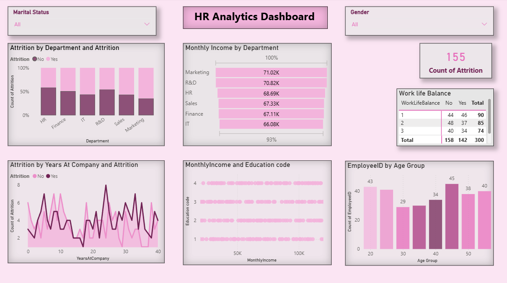
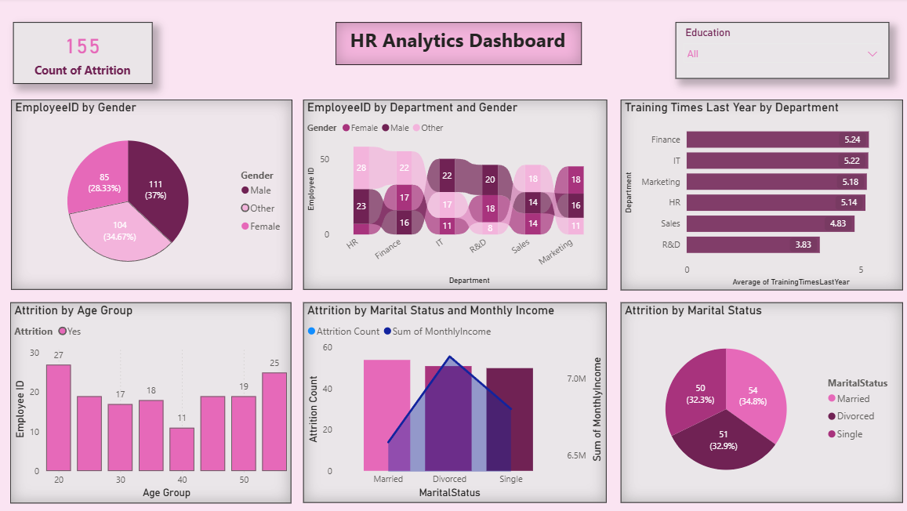

# 👩‍💼 HR Analytics Dashboard

A Power BI dashboard project analyzing employee data to uncover insights related to attrition, workforce demographics, and organizational performance.

---

## 📌 Project Overview
This project focuses on analyzing HR data to identify patterns in employee attrition, income distribution, and workforce structure. The dashboard provides actionable insights for improving employee retention and decision-making.

---

## 🎯 Objectives
- Analyze employee attrition trends
- Identify high-risk departments
- Understand salary distribution across departments
- Evaluate workforce demographics (age, gender, marital status)

---

## 🛠 Tools Used
- Power BI
- Excel

---

## 📊 Dashboard Features
- Attrition Analysis by Department
- Monthly Income Distribution
- Employee Demographics (Age, Gender)
- Work-Life Balance Insights
- Training Analysis by Department

---

## 📂 Files Included
- `HR Analytics Dashboard.pbix` → Power BI file
- `HR Dataset.xlsx` → Dataset
- `Dashboard Preview.png` → Dashboard screenshot

---

## 📊 Dashboard Preview

### Page 1

### Page 2

---

## 📈 Key Insights
- Certain departments show higher attrition rates
- Work-life balance impacts attrition significantly
- Income variation exists across departments
- Workforce is unevenly distributed across age groups

---

## 🔗 How to Use
1. Open dataset in Excel
2. Load `.pbix` file in Power BI
3. Explore interactive dashboard

---

## 👩‍💻 Author
Ananya Datta
